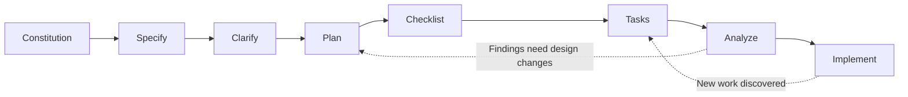

# Team Kanban

**Language:** English | [Tiếng Việt](README.vi.md)

Team Kanban is a small-group task management web application built around a focused Kanban board. It helps a team organize work, see task status at a glance, assign responsibility, discuss tasks, and review a basic activity history.

## Features

- Email and password sign-up and login, session-aware auth pages, and logout.
- A personal workspace where each user can create and manage boards.
- Three default workflow columns: **To Do**, **In Progress**, and **Done**. Owners can add, rename, reorder, and remove columns.
- Task cards with descriptions, drag-and-drop status changes, keyboard-accessible move controls, comments, and assignees from the board's existing members.
- Optimistic card moves with rollback and an error message if saving fails.
- A basic per-board Activity Log for changes such as card moves, assignments, comments, and board activity.
- Owner-only board deletion.
- One idempotent, pre-populated demo board per owner. Demo cards are assigned to that owner; creating the board does not create demo accounts or extra members.
- Vietnamese and English UI, with Vietnamese as the default language.

## Technology

- **Next.js App Router** and **TypeScript** for the frontend and the backend-for-frontend (BFF) in one application.
- **React** Client Components for interactive UI.
- **Supabase Auth** for email/password identity and session management.
- **Supabase Postgres** for boards, columns, cards, members, comments, and activity data.
- **Row Level Security (RLS)** and database constraints/functions for access control and atomic operations.
- **`@supabase/ssr`** for cookie-based Supabase clients on the server and browser.
- **`@hello-pangea/dnd`** for Kanban drag-and-drop.

## Rendering and request flow

- `app/(workspace)/boards/page.tsx` and `app/(workspace)/boards/[boardId]/page.tsx` are Server Components. They verify the current session, check board access, and load initial data from Supabase before returning the page.
- Interactive board components under `components/board/` are Client Components. They handle drag-and-drop, optimistic updates, forms, and browser events after hydration. Client Components can still be pre-rendered to HTML by Next.js on the initial request; `"use client"` marks the client interaction boundary.
- `app/api/v1/**/route.ts` contains server-side Route Handlers for JSON mutations and reads. They verify identity and permissions before using Supabase.
- `app/(auth)/actions.ts` contains Server Actions for sign-up, login, and logout. `proxy.ts` refreshes the Supabase cookie session and redirects unauthenticated requests away from `/boards`.
- Board pages and private API responses are user-specific. RLS remains the database-level access-control boundary.

## Repository layout

```text
app/
  (auth)/                 Login/signup pages and auth Server Actions
  (workspace)/            Server-rendered board routes
  api/v1/                 Server Route Handlers (BFF)
  layout.tsx              Root layout, metadata, and locale initialization
  page.tsx                Landing page
components/
  auth/                   Auth form and logout control
  board/                  Board, column, card, comments, members, activity
  i18n/                   Locale provider and language switcher
lib/
  auth/                   Session guards and auth redirects
  boards/ cards/ ...      Data access, domain types, and queries
  permissions/            Board role checks
  supabase/               Server and browser Supabase clients
  i18n/                   Vietnamese/English messages and locale helpers
  http/ validation/       API responses and input validation
supabase/
  config.toml             Local Supabase configuration
  migrations/             Ordered database schema and policy changes
specs/001-team-kanban/    Feature spec, plan, data model, API contract, tasks
proxy.ts                  Session refresh and early workspace redirects
```

The route groups `(auth)` and `(workspace)` organize pages without adding those names to URLs. For example, `app/(auth)/login/page.tsx` is served at `/login`.

## Requirements

- Node.js **20.9 or newer**.
- npm.
- Docker Desktop or Docker Engine for local Supabase.
- Supabase CLI, available through `npx supabase` in this repository.
- A Supabase project for hosted deployment.

## Run locally

1. Install dependencies:

   ```bash
   npm install
   ```

2. Start the local Supabase stack and read the local API URL and publishable key:

   ```bash
   npx supabase start
   npx supabase status
   ```

3. Create `.env.local` in the repository root:

   ```env
   NEXT_PUBLIC_SUPABASE_URL=http://127.0.0.1:54321
   NEXT_PUBLIC_SUPABASE_PUBLISHABLE_KEY=sb_publishable_...
   ```

   Use the values printed by `supabase status`. These are public project connection settings; never commit `.env.local`.

4. Apply pending migrations incrementally:

   ```bash
   npx supabase migration list --local
   npx supabase db push --local
   ```

   `db push --local` applies migrations that have not run yet. Avoid `db reset` if you need to preserve local data.

5. Start Next.js:

   ```bash
   npm run dev
   ```

6. Open [http://localhost:3000](http://localhost:3000). Supabase Studio is available at [http://127.0.0.1:54323](http://127.0.0.1:54323).

The local Supabase configuration disables email confirmation for the MVP. On a hosted Supabase project, configure **Authentication → Providers → Email → Confirm email** to match that behavior. `supabase/config.toml` does not configure the hosted project's Auth settings. Set the hosted project's Site URL to the production domain, and set the two environment variables above in Vercel's Production environment before redeploying.

## Production database

Link the Supabase CLI to the hosted project and apply pending migrations when ready:

```bash
npx supabase link --project-ref <project-ref>
npx supabase migration list --linked
npx supabase db push --linked
```

Set `NEXT_PUBLIC_SUPABASE_URL` and `NEXT_PUBLIC_SUPABASE_PUBLISHABLE_KEY` in Vercel. No Supabase Auth Admin or service-role key is needed by the current application.

## Useful commands

```bash
npm run dev           # Start the development server
npm run build         # Create a production build
npm run start         # Serve a production build
npm run lint          # Run ESLint
npx tsc --noEmit      # Check TypeScript types
```

## Product and design documentation

The feature documentation is maintained in Vietnamese with standard English IT terminology:

- [Feature specification](specs/001-team-kanban/spec.md)
- [Implementation plan](specs/001-team-kanban/plan.md)
- [Data model and RLS](specs/001-team-kanban/data-model.md)
- [HTTP API contract](specs/001-team-kanban/contracts/api.md)
- [Local setup and manual scenarios](specs/001-team-kanban/quickstart.md)
- [Implementation tasks](specs/001-team-kanban/tasks.md)

## SpecKit workflow used

The feature was developed with a SpecKit, specification-driven workflow. The artifacts live in `specs/001-team-kanban/` and follow this flow:



1. **Constitution** sets project principles such as smooth interactions, performance, secure access, and Vietnamese/English UI.
2. **Specify** records product requirements, user stories, and acceptance scenarios in `spec.md`.
3. **Clarify** resolves open product decisions, including drag-and-drop behavior, assignment rules, authentication, and board permissions.
4. **Plan** turns the requirements into an architecture and implementation approach in `plan.md`, `research.md`, and `data-model.md`. Context7 was used to consult current framework and Supabase documentation while planning.
5. **Checklist** provides a focused quality review of the requirements.
6. **Tasks** breaks the plan into ordered implementation work in `tasks.md`.
7. **Analyze** checks that the specification, plan, and tasks agree before implementation.
8. **Implement** executes the tasks by phase and updates the code, migrations, documentation, and task status.

Use [the specification](specs/001-team-kanban/spec.md) as the product source of truth, [the plan](specs/001-team-kanban/plan.md) for architecture, and [the task list](specs/001-team-kanban/tasks.md) to track implementation progress.
