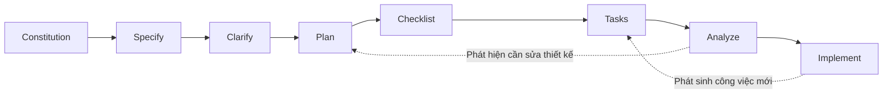

# Team Kanban

**Ngôn ngữ:** [English](README.md) | Tiếng Việt

Team Kanban là web application quản lý công việc cho nhóm nhỏ, tập trung vào Kanban board gọn và thao tác mượt. Nhóm có thể tổ chức công việc theo trạng thái, phân công người phụ trách, trao đổi trên từng task và theo dõi Activity Log cơ bản.

## Tính năng

- Đăng ký và đăng nhập bằng email/password; trang auth tự chuyển hướng theo trạng thái session; có logout.
- Workspace riêng, nơi mỗi user có thể tạo và quản lý board.
- Ba workflow column mặc định: **To Do**, **In Progress**, **Done**. Owner có thể thêm, đổi tên, sắp xếp và xóa column.
- Task card có mô tả, kéo thả để đổi trạng thái, thao tác di chuyển bằng keyboard, comment và assign cho thành viên hiện có của board.
- Card được cập nhật optimistic; nếu lưu thất bại, UI rollback về dữ liệu đã lưu và báo lỗi.
- Activity Log theo board, ghi lại các thay đổi như di chuyển card, assign, comment và hoạt động trên board.
- Chỉ owner được xóa board.
- Mỗi owner có thể tạo một demo board idempotent, có sẵn cards mẫu. Cards mẫu được assign cho owner; demo board không tạo demo account hoặc member bổ sung.
- UI hỗ trợ tiếng Việt và tiếng Anh, mặc định tiếng Việt.

## Công nghệ

- **Next.js App Router** và **TypeScript** cho frontend và backend-for-frontend (BFF) trong cùng một application.
- **React Client Components** cho UI tương tác.
- **Supabase Auth** quản lý user email/password và session.
- **Supabase Postgres** lưu board, column, card, member, comment và activity.
- **Row Level Security (RLS)** cùng database constraints/functions để kiểm soát quyền và bảo đảm thao tác nguyên tử.
- **`@supabase/ssr`** tạo Supabase client dùng cookie trên server và browser.
- **`@hello-pangea/dnd`** xử lý kéo thả card.

## Rendering và request flow

- `app/(workspace)/boards/page.tsx` và `app/(workspace)/boards/[boardId]/page.tsx` là Server Components. Chúng xác minh session, kiểm tra quyền board và tải dữ liệu ban đầu từ Supabase trước khi trả trang.
- Các component tương tác trong `components/board/` là Client Components. Chúng xử lý kéo thả, optimistic update, form và browser events sau hydration. Next.js vẫn có thể render Client Component thành HTML ban đầu ở server; `"use client"` đánh dấu ranh giới cần chạy tương tác phía browser.
- `app/api/v1/**/route.ts` chứa Route Handler phía server cho JSON API. Mỗi handler xác minh danh tính và quyền trước khi thao tác Supabase.
- `app/(auth)/actions.ts` chứa Server Action đăng ký, đăng nhập và đăng xuất. `proxy.ts` refresh Supabase cookie session và redirect người chưa đăng nhập khỏi `/boards`.
- Board pages và API riêng tư chứa dữ liệu theo user. RLS là lớp kiểm soát truy cập tại database.

## Cấu trúc repository

```text
app/
  (auth)/                 Trang login/signup và Server Actions cho auth
  (workspace)/            Route board được render ở server
  api/v1/                 Route Handler phía server (BFF)
  layout.tsx              Root layout, metadata, khởi tạo locale
  page.tsx                Landing page
components/
  auth/                   Form auth và nút logout
  board/                  Board, column, card, comment, member, activity
  i18n/                   Locale provider và language switcher
lib/
  auth/                   Session guard và auth redirect
  boards/ cards/ ...      Data access, domain types và queries
  permissions/            Kiểm tra board role
  supabase/               Supabase client phía server và browser
  i18n/                   Message tiếng Việt/Anh và locale helpers
  http/ validation/       API response và input validation
supabase/
  config.toml             Cấu hình Supabase local
  migrations/             Database schema, policy và function theo thứ tự
specs/001-team-kanban/    Feature spec, plan, data model, API contract, tasks
proxy.ts                  Refresh session và redirect sớm cho workspace
```

Route group đặt trong ngoặc như `(auth)` và `(workspace)` chỉ giúp tổ chức source, không xuất hiện trong URL. Ví dụ `app/(auth)/login/page.tsx` có URL là `/login`.

## Yêu cầu

- Node.js **20.9 trở lên**.
- npm.
- Docker Desktop hoặc Docker Engine để chạy Supabase local.
- Supabase CLI; có thể chạy qua `npx supabase` trong repository.
- Một Supabase project nếu triển khai hosted.

## Chạy local

1. Cài dependencies:

   ```bash
   npm install
   ```

2. Khởi động Supabase local và lấy API URL cùng publishable key:

   ```bash
   npx supabase start
   npx supabase status
   ```

3. Tạo file `.env.local` tại root repository:

   ```env
   NEXT_PUBLIC_SUPABASE_URL=http://127.0.0.1:54321
   NEXT_PUBLIC_SUPABASE_PUBLISHABLE_KEY=sb_publishable_...
   ```

   Dùng giá trị `API_URL` và `PUBLISHABLE_KEY` do `supabase status` in ra. Không commit `.env.local`.

4. Apply các migration còn thiếu theo cách incremental:

   ```bash
   npx supabase migration list --local
   npx supabase db push --local
   ```

   `db push --local` chỉ áp dụng migration chưa chạy. Tránh `db reset` nếu cần giữ data local.

5. Chạy Next.js:

   ```bash
   npm run dev
   ```

6. Mở [http://localhost:3000](http://localhost:3000). Supabase Studio chạy tại [http://127.0.0.1:54323](http://127.0.0.1:54323).

Cấu hình Supabase local tắt email confirmation theo MVP. Với Supabase hosted, cấu hình **Authentication → Providers → Email → Confirm email** tương tự. `supabase/config.toml` không thay đổi cấu hình Auth của project hosted. Đặt Site URL của hosted project thành domain production và thêm hai environment variables bên trên vào Vercel Production trước khi redeploy.

## Database production

Link Supabase CLI với hosted project rồi apply migration còn thiếu khi cần:

```bash
npx supabase link --project-ref <project-ref>
npx supabase migration list --linked
npx supabase db push --linked
```

Trong Vercel, cấu hình `NEXT_PUBLIC_SUPABASE_URL` và `NEXT_PUBLIC_SUPABASE_PUBLISHABLE_KEY`. Application hiện tại không cần Supabase Auth Admin key hoặc service-role key.

## Lệnh thường dùng

```bash
npm run dev           # Chạy development server
npm run build         # Tạo production build
npm run start         # Chạy production build
npm run lint          # Chạy ESLint
npx tsc --noEmit      # Kiểm tra TypeScript types
```

## Tài liệu sản phẩm và thiết kế

Spec và tài liệu feature được viết bằng tiếng Việt, sử dụng các thuật ngữ IT tiếng Anh phổ biến:

- [Feature specification](specs/001-team-kanban/spec.md)
- [Implementation plan](specs/001-team-kanban/plan.md)
- [Data model và RLS](specs/001-team-kanban/data-model.md)
- [HTTP API contract](specs/001-team-kanban/contracts/api.md)
- [Hướng dẫn local và manual scenarios](specs/001-team-kanban/quickstart.md)
- [Implementation tasks](specs/001-team-kanban/tasks.md)

## SpecKit flow đã dùng

Feature được triển khai theo quy trình SpecKit, tức specification-driven development. Các artifact nằm trong `specs/001-team-kanban/` và đi theo flow:



1. **Constitution** xác định nguyên tắc dự án như thao tác mượt, hiệu năng, phân quyền an toàn và UI Việt/Anh.
2. **Specify** ghi lại yêu cầu sản phẩm, user story và acceptance scenario trong `spec.md`.
3. **Clarify** làm rõ các quyết định còn thiếu, gồm hành vi kéo thả, quy tắc assign, xác thực và quyền trên board.
4. **Plan** chuyển yêu cầu thành kiến trúc và cách triển khai trong `plan.md`, `research.md`, `data-model.md`. Context7 được dùng để tra cứu tài liệu framework và Supabase hiện hành trong lúc lập kế hoạch.
5. **Checklist** tạo checklist tập trung để rà soát chất lượng yêu cầu.
6. **Tasks** chia kế hoạch thành các công việc có thứ tự trong `tasks.md`.
7. **Analyze** đối chiếu tính nhất quán giữa spec, plan và tasks trước khi code.
8. **Implement** thực hiện task theo phase, đồng thời cập nhật code, migration, tài liệu và trạng thái task.

Dùng [specification](specs/001-team-kanban/spec.md) làm nguồn chuẩn cho yêu cầu sản phẩm, [plan](specs/001-team-kanban/plan.md) cho kiến trúc và [task list](specs/001-team-kanban/tasks.md) để theo dõi tiến độ triển khai.
